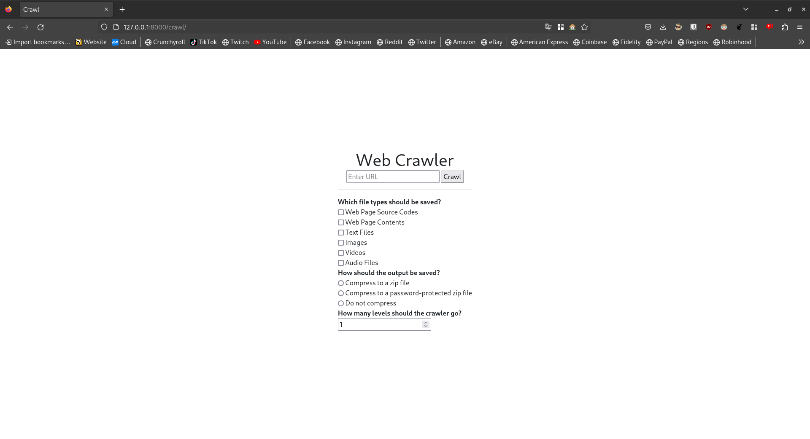
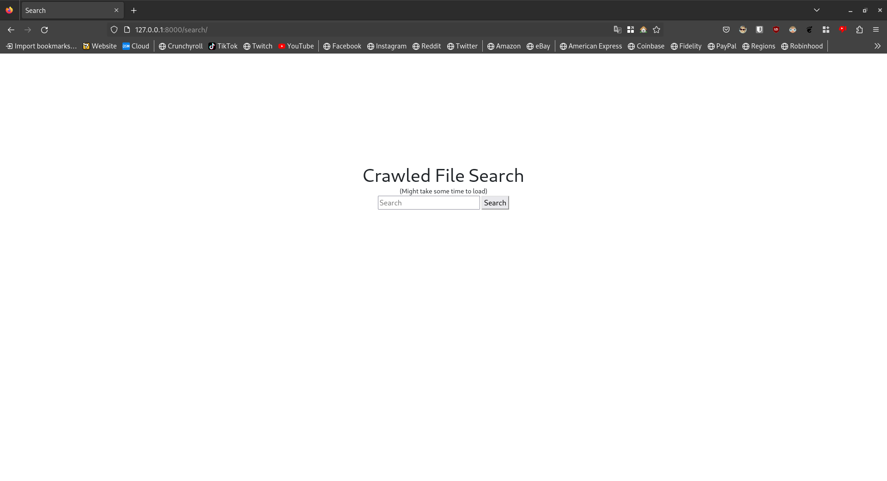
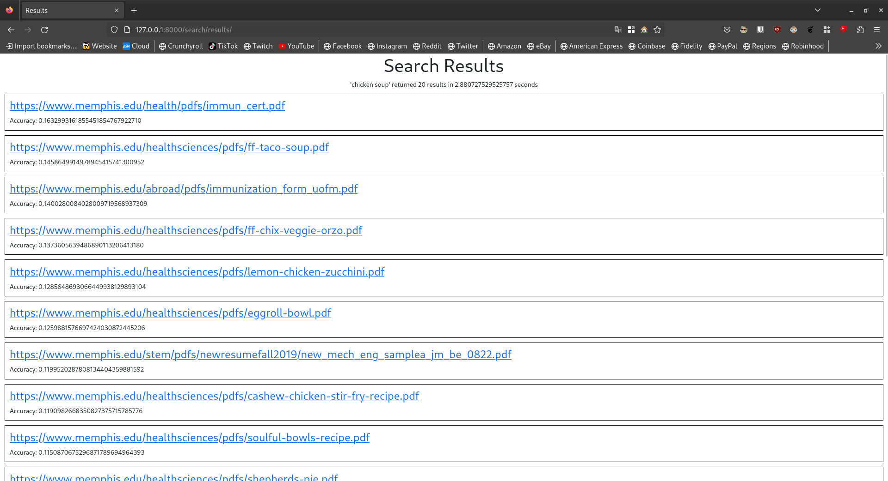

# Cradose

  **This project is still WIP, expect bugs and missing features**

Cradose (CRAwl, DOcument, and SEarch) is a web application built using the Django framework that can crawl, index, download, and search the web.

## Features

- Crawl any inputted url
- Select any depth to crawl to
- Download specific file types
- Index crawled pages
- Search the downloaded pages for any query
- Display urls sorted by relevance

## Prerequisites

To run this you need to have Python>=3.10. Other requirements can be installed using `pip install -r requirements.txt`.

Installation instructions for Django can be found [here](https://www.djangoproject.com/download/).

## Usage

_Note_: This program uses relative directories which is defined in `settings.py`, so it should work out of the box.

To run, make sure you're in the root directory of this project then run `python manage.py runserver`. This will start the server on `localhost:8000`.

#### Crawling
To crawl a webpage, go to [localhost:8000/crawl](localhost:8000/crawl), and enter a url and fill out the settings below. You will know the program is finished running when you are redirected to the search page.

#### Searching
To use the search engine, go to [localhost:8000/search](localhost:8000/search) and enter your query in the search bar. Once you hit enter, the program will begin running. Once the program is finished running (might take some time), you will be redirected to a page that lists all of the relevant urls. Clicking on any of these urls will take you to the original page that was crawled.

## Screenshots

